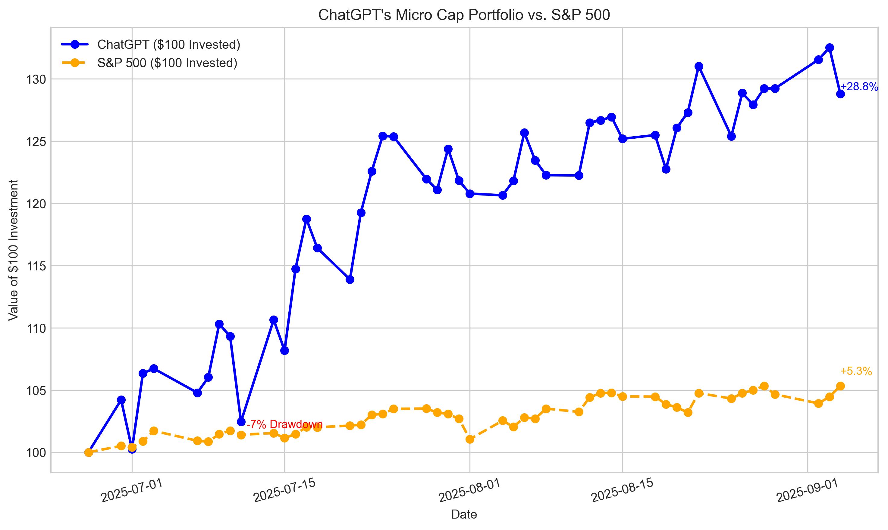

# ChatGPT Micro-Cap Experiment

🤖 **AI-Powered Trading**: A 6-month live trading experiment where ChatGPT manages a real-money micro-cap portfolio starting with $100.

> ## ⚠️ IMPORTANT: Client Portal Implementation
> This system now uses **Interactive Brokers Client Portal REST API** instead of TWS/Gateway.  
> All commands reference `cp_executor.py` and use `cp_config.yaml` configuration.  
> **No TWS/Gateway installation required** - just the Client Portal Gateway.

## 🎯 Quick Navigation

- [About the Experiment](#-the-concept)
- [Quick Start](#-quick-start-tldr)
- [Current Performance](#-current-performance)
- [Installation & Setup](#-installation--setup)
- [Usage Guide](#-usage-guide)
- [Documentation](#-documentation)
- [Repository Structure](#-repository-structure)

---

## 🎯 The Concept

Every day, I kept seeing the same ad about having some A.I. pick undervalued stocks. It was obvious it was trying to get me to subscribe to some garbage, so I just rolled my eyes.  
Then I started wondering, **"How well would that actually work?"**

So, starting with just $100, I wanted to answer a simple but powerful question:

**Can powerful large language models like ChatGPT actually generate alpha (or at least make smart trading decisions) using real-time data?**

### Each trading day:
- I provide it trading data on the stocks in its portfolio
- Strict stop-loss rules apply
- Every week I allow it to use deep research to reevaluate its account
- I track and publish performance data weekly on my blog: [A.I Controls Stock Account](https://nathanbsmith729.substack.com)

---

## 🚀 Quick Start (TL;DR)

This system consists of **four modules** that work together:

1. **Autopilot Script** (`autopilot.sh`) - **Automated orchestration with time-based scheduling**
2. **ChatGPT Trading Script** (`trading_script.py`) - Generates CSV trade signals (supports full non-interactive mode)
3. **Interactive Brokers Module** (`ib_trading/`) - Executes trades automatically via Client Portal  
4. **Web Monitor Interface** (`web_monitor/`) - Real-time pipeline monitoring

**Essential Commands:**
```bash
# AUTOMATED: Complete pipeline with scheduling (recommended)
./autopilot.sh start    # Starts everything automatically
./autopilot.sh status   # Check if running
./autopilot.sh stop     # Graceful shutdown

# MANUAL: Individual components
# 1. Generate trade signals with ChatGPT (non-interactive)
python trading_script.py --file "Start Your Own/chatgpt_portfolio_update.csv" \
  --no-interactive --starting-cash 10000

# 2. Execute trades automatically (dry-run first!)
cd ib_trading
python cp_executor.py --dry-run --show-trades

# 3. Run live execution (requires Client Portal running)
python cp_executor.py --execute-pending --date $(date +%Y-%m-%d)

# 4. Start web monitoring dashboard (globally accessible)
cd web_monitor
python app.py
# Access at: http://localhost:8889 or http://YOUR_IP:8889
```

---

## 📊 Current Performance

**Last Updated:** August 29th, 2025



**Current Status:** Portfolio is outperforming the S&P 500 benchmark

*Performance data is updated after each trading day. See the CSV files in `Scripts and CSV Files/` for detailed daily tracking.*

---

## 📦 Installation & Setup

<details>
<summary><strong>🔧 Prerequisites & Dependencies</strong></summary>

### 1. Python Environment

```bash
# Create virtual environment
python -m venv venv
source venv/bin/activate  # Windows: venv\Scripts\activate

# Install dependencies (root covers Client Portal deps)
pip install -r requirements.txt

# Web monitor dependencies
cd web_monitor
pip install -r requirements.txt
```

### 2. Interactive Brokers Client Portal Setup

**Install Client Portal Gateway:**
- Download from [Interactive Brokers Client Portal](https://www.interactivebrokers.com/en/trading/client-portal-gateway.php)
- Set up paper trading account (recommended for testing)
- Start Client Portal Gateway on localhost:5000

**Client Portal Configuration:**
```
Default Port: 5000
Base URL: https://localhost:5000/v1/api
SSL: Self-signed certificate (verification disabled)
Authentication: Session-based (login via web browser first)
```

**Setup Steps:**
1. Start Client Portal Gateway
2. Navigate to https://localhost:5000 in browser
3. Login with IB credentials
4. Keep session active while trading

### 3. System Requirements
- Python 3.11+
- Internet connection for market data
- ~10MB storage for CSV data files
- UNIX tools: `bash`, `curl`, `pgrep`, `awk`

</details>

<details>
<summary><strong>🏗️ System Architecture</strong></summary>

### Three-Module Design

This system implements a **complete separation of concerns** between trade generation, execution, and monitoring:

```
┌─────────────────┐    CSV Files    ┌─────────────────────┐
│  ChatGPT        │ ──────────────→ │  Client Portal      │
│  Trading Script │   Trade Signals │  Executor Module    │
│                 │                 │                     │
│ • Portfolio mgmt│                 │ • REST API orders   │
│ • Stop-loss     │                 │ • Position tracking │
│ • Trade signals │                 │ • Risk management   │
└─────────────────┘                 └─────────────────────┘
                                              │
                                              ▼ Execution Logs
                                    ┌─────────────────────┐
                                    │   Web Monitor       │
                                    │   Interface         │
                                    │                     │
                                    │ • Real-time dashboard│
                                    │ • Performance metrics│
                                    │ • Global web access │
                                    │ • File watching     │
                                    └─────────────────────┘
```

### Data Flow

1. **ChatGPT Module** creates trade signals in `chatgpt_trade_log.csv`:
   ```csv
   Date,Ticker,Shares Bought,Buy Price,Cost Basis,PnL,Reason,Shares Sold,Sell Price
   2025-09-06,AZTR,55.0,0.25,13.75,0.0,MANUAL BUY - New position,,
   ```

2. **Client Portal Module** reads these CSVs and executes trades through Interactive Brokers Client Portal REST API

3. **Execution logging** records actual CP trades in `cp_execution_log.csv`:
   ```csv
   execution_date,execution_time,order_id,ticker,action,quantity,executed_price,status
   2025-09-06,09:30:15,123456,AZTR,BUY,55.0,0.26,FILLED
   ```

4. **Web Monitor** provides real-time dashboard with:
   - Live portfolio positions and P&L
   - Pending trades queue with validation status
   - Execution history with slippage analysis
   - Performance metrics and system health
   - Global internet access for remote monitoring

</details>

### ASCII Architecture & APIs

```
                                        (shell_logger.py / pipeline_logger.py)
                   ┌────────────────┐       structured JSON logs       ┌─────────────────────────┐
                   │   autopilot.sh │ ───────────────────────────────▶ │ logs/                   │
                   │  (scheduler)   │  ◀───────────────┐               │  - pipeline_actions.jsonl
                   └───────┬────────┘                  │               │  - execution_tracking.jsonl
                           │ (invoke)                  │               │  - pipeline_errors.jsonl  │
                           │                           │               └─────────────────────────┘
            ┌──────────────┴──────────────┐            │
            │                             │            │
            ▼                             ▼            │
┌──────────────────────┐        ┌──────────────────────┐ │    ┌───────────────────────────┐
│ trading_script.py    │        │ ib_trading/cp_executor│ │    │ web_monitor (FastAPI + WS)│
│ - market data (HTTP) │        │ - Client Portal REST │ │    │ - /api/* endpoints        │
│ - stop-loss / signals│        │ - execution logging  │ │    │ - /ws websocket           │
└──────────┬───────────┘        └──────────┬───────────┘ │    └───────────┬───────────────┘
           │ CSV write                          │ REST API calls         │ file watch + cache
           │                                     │                       │
           ▼                                     ▼                       ▼
┌───────────────────────────────────────────┐   ┌──────────────────────┐  ┌───────────────────────┐
│ Scripts and CSV Files/                    │   │ IB Client Portal     │  │  /tmp/autopilot_status│
│ - chatgpt_portfolio_update.csv            │   │ Gateway              │  │  (TUI status JSON)    │
│ - chatgpt_trade_log.csv                   │   │ https://localhost:5000│ └───────────────────────┘
│ - ib_trading/cp_execution_log.csv         │   │ /v1/api              │
└───────────────────────────────────────────┘   └──────────────────────┘

External Market Data:
  - Yahoo Finance via yfinance (HTTPS)
  - Stooq via pandas-datareader (HTTPS) or CSV (https://stooq.com/q/d/l/?s=...)

Client Portal REST (examples):
  GET    /tickle
  GET    /iserver/auth/status
  GET    /sso/validate            (best-effort)
  POST   /iserver/reauthenticate  (interactive auth trigger)
  GET    /portfolio/accounts
  GET    /iserver/secdef/search?symbol=XYZ&secType=STK
  POST   /iserver/account/{acctId}/orders                 (place order)
  GET    /iserver/account/{acctId}/orders                 (order status)
  DELETE /iserver/account/{acctId}/order/{orderId}        (cancel)

Web Monitor API (http://localhost:8889):
  GET  /api/status
  GET  /api/portfolio
  GET  /api/trades/pending
  GET  /api/trades/executed?days=N
  GET  /api/performance
  GET  /api/logs
  WS   /ws                       (real-time updates)

Autopilot → Web Monitor:
  POST /api/cache/refresh         (force refresh dashboard cache)
```

<details>
<summary><strong>⚙️ Configuration</strong></summary>

### Client Portal Trading Configuration

Edit `ib_trading/cp_config.yaml`:

```yaml
# Client Portal Gateway settings
client_portal:
  host: "localhost"
  port: 5000
  base_url: "https://localhost:5000/v1/api"
  ssl:
    verify: false              # Self-signed cert
  timeouts:
    connect: 10
    read: 30
    total: 60

# Trading configuration
trading:
  account_id: ""              # Empty = default account
  mode: "paper"               # "paper" or "live"
  
  # Safety limits - CRITICAL
  safety:
    max_order_value: 10000.00
    max_daily_trades: 50
    max_position_size: 1000
    min_price: 0.01           # Don't trade penny stocks
    max_price: 10000.00       # Price sanity check
    max_quantity: 10000       # Share quantity limit

# Data monitoring
monitoring:
  data_directories:
    - "../Start Your Own"        # For testing
    - "../Scripts and CSV Files" # Your live portfolio
  poll_interval: 60             # Check CSVs every 60 seconds
```

### Web Monitor Configuration

Edit `web_monitor/config.yaml`:

```yaml
server:
  host: "0.0.0.0"  # Listen on all interfaces for global access
  port: 8889
  reload: false

monitoring:
  data_directories:
    - "../Scripts and CSV Files"
    - "../Start Your Own"
    - "../ib_trading"
  
  cache_size: 1000
  update_interval: 0.1  # 100ms debouncing for file changes

display:
  max_recent_trades: 50
  max_log_lines: 100
  chart_days: 30
```

### Safety Settings

**Client Portal Trading Safety:**
- **Paper Trading**: Always start with `mode: "paper"`
- **Order Limits**: `max_order_value` prevents accidentally large orders
- **Price Filters**: Avoid stocks below $0.01 or above $10000
- **Daily Limits**: `max_daily_trades` prevents runaway execution
- **SSL Verification**: Disabled for self-signed certificates

**Web Monitor Safety:**
- **Read-Only**: Never modifies CSV files or trading data
- **Global Access**: Configured for internet access (use firewall if needed)
- **No Authentication**: Designed for trusted networks only

</details>

---

## 🎮 Usage Guide

### Automated Usage (Recommended)

```bash
# Complete automated pipeline - handles everything
./autopilot.sh start     # Starts full pipeline with scheduling
./autopilot.sh status    # Check system status  
./autopilot.sh logs      # View recent activity
./autopilot.sh stop      # Graceful shutdown

# Control commands
./autopilot.sh pause     # Pause trading (keep web monitor running)
./autopilot.sh resume    # Resume trading operations
./autopilot.sh force     # Force immediate portfolio update
./autopilot.sh skip      # Skip next scheduled execution
```

First run tip:

- Use `./autopilot.sh fresh 10000` to clear state and initialize a clean portfolio with `$10,000` starting cash. Autopilot passes this to the trading script automatically.

### Manual Usage

```bash
# Generate today's trade signals (non-interactive)
python trading_script.py --file "Start Your Own/chatgpt_portfolio_update.csv" \
  --no-interactive --starting-cash 10000

# Preview trades without executing
cd ib_trading
python cp_executor.py --dry-run --show-trades

# Start web monitoring dashboard
cd web_monitor
python app.py
```

<details>
<summary><strong>🔧 Interactive Brokers Integration</strong></summary>

### Daily Manual Execution with Web Monitoring

**Step 1 - Start Web Monitor:**
```bash
cd web_monitor
python app.py &  # Run in background
# Access dashboard at http://localhost:8889 or http://YOUR_IP:8889
```

**Step 2 - Generate Trade Signals:**
```bash
# Run ChatGPT trading script to update portfolio and generate signals
python trading_script.py --file "Start Your Own/chatgpt_portfolio_update.csv" \
  --no-interactive --starting-cash 10000
# Watch real-time updates in web dashboard
```

**Step 3 - Review Pending Trades:**
```bash
cd ib_trading

# See what trades would be executed (no IB connection needed)
python cp_executor.py --dry-run --show-trades
# Or view pending trades in web dashboard
```

**Step 4 - Execute Trades:**
```bash
# Start Client Portal Gateway first, then execute
python cp_executor.py --execute-pending --date $(date +%Y-%m-%d)
# Monitor execution in real-time via web dashboard
```

### Automated Monitor Mode

**Start both web dashboard and automated trading:**

```bash
# Terminal 1: Start web monitor
cd web_monitor
python app.py &

# Terminal 2: Start automated trading
cd ib_trading
python cp_executor.py --monitor
# Monitor with custom polling interval
python cp_executor.py --monitor --config ib_config.yaml
```

### Testing & Verification

```bash
cd ib_trading

# Test CSV parsing and trade detection
python cp_executor.py --dry-run --show-trades

# Test with specific data directory
python cp_executor.py --dry-run --data-dir "../Start Your Own"

# Demo script (shows Client Portal integration)
./demo_cp_integration.sh
```

Additional checks (optional):

```bash
# From repo root
python test_pipeline_logger.py    # Verifies structured logging + audit report
python test_tui_integration.py    # Verifies TUI/status integration and shell helpers
```

### Paper Trading Verification

Before going live, always test with paper trading:

1. **Client Portal Gateway**: Run locally on port 5000 (default)
2. **Config**: Set `mode: "paper"` in `ib_trading/cp_config.yaml`
3. **Test Small Orders**: Start with small quantities
4. **Review Logs**: Check `ib_trading/cp_execution_log.csv` for execution details

```bash
cd ib_trading

# Execute one trade in paper mode
python cp_executor.py --execute-pending --date $(date +%Y-%m-%d) --no-confirm
```

</details>

<details>
<summary><strong>📊 Web Monitoring Dashboard</strong></summary>

### Real-Time Pipeline Monitoring

The web interface provides comprehensive real-time monitoring of your trading pipeline:

**🌍 Global Access:**
- **Local:** http://localhost:8889
- **Network:** http://YOUR_IP:8889  
- **Internet:** Accessible globally (configure firewall as needed)

**📊 Dashboard Features:**

#### System Status Bar
- **IB Connection:** Live status of Interactive Brokers connection
- **Trading Mode:** Paper vs Live trading indication  
- **Last Activity:** Timestamp of most recent system activity
- **File Monitoring:** Real-time CSV file change detection

#### Portfolio Panel
- **Live positions** with current prices and P&L
- **Total portfolio value** and unrealized gains/losses
- **Stop-loss levels** for risk management
- **Position count** and allocation summary

#### Pending Trades Panel  
- **Queue of unexecuted trades** from CSV files
- **Validation status** (valid/invalid with reasons)
- **Trade details:** ticker, quantity, price, action
- **Source tracking** (which CSV generated the trade)

#### Execution History Panel
- **Recent IB executions** with timestamps
- **Order status** (filled, pending, cancelled)  
- **Actual execution prices** vs expected
- **Commission and slippage tracking**

#### Performance Metrics
- **Daily P&L** and volume statistics
- **Average slippage** analysis
- **Trade execution success rates**
- **Performance charts** (placeholder for now)

### API Endpoints

Access monitoring data programmatically:

```bash
# System status
curl http://localhost:8889/api/status

# Current portfolio  
curl http://localhost:8889/api/portfolio

# Pending trades
curl http://localhost:8889/api/trades/pending

# Execution history
curl http://localhost:8889/api/trades/executed?days=7

# Performance metrics
curl http://localhost:8889/api/performance

# System logs
curl http://localhost:8889/api/logs
```

### Technical Features

**🚀 Performance:**
- Sub-millisecond API response times
- LRU cache with 1000-item capacity  
- Debounced file watching (100ms)
- WebSocket for real-time updates

**🛡️ Security:**
- Read-only monitoring (never modifies data)
- No authentication (designed for trusted networks)
- CORS enabled for development
- Global internet access configurable

**🎨 Interface:**
- Dark terminal theme with syntax highlighting
- Responsive design (desktop, tablet, mobile)
- Pure JavaScript (no framework dependencies)
- Single HTML file (no build process)

</details>

<details>
<summary><strong>🔄 Workflow Examples</strong></summary>

### Workflow A: Manual Daily Trading

```bash
# 1. Generate today's signals with ChatGPT script
python trading_script.py --file "Scripts and CSV Files/chatgpt_portfolio_update.csv" \
  --no-interactive --starting-cash 10000

# 2. Review what would be executed
cd ib_trading
python cp_executor.py --dry-run --show-trades

# 3. Start IB Gateway (paper mode: port 7497)
# 4. Execute the trades
python cp_executor.py --execute-pending --date $(date +%Y-%m-%d)

# 5. Review execution results
python cp_executor.py --show-executions --days 1
```

### Workflow B: Automated Trading

```bash
# 1. Start IB Gateway in paper/live mode
# 2. Start continuous monitoring
cd ib_trading
python cp_executor.py --monitor

# The system will now:
# - Check for new CSV signals every 60 seconds
# - Execute trades automatically
# - Log all activity
# - Continue until stopped
```

### Workflow C: Historical Analysis

```bash
# 1. Generate historical data
python trading_script.py --asof 2025-08-01 --file "Start Your Own/chatgpt_portfolio_update.csv"

# 2. See what trades would have been made
cd ib_trading
python cp_executor.py --dry-run --date 2025-08-01

# 3. Analyze execution history
python cp_executor.py --show-executions --days 30
```

</details>

---

## 📚 Documentation

<details>
<summary><strong>📖 Command Reference</strong></summary>

### IB Executor Commands

```bash
cd ib_trading

# Execution modes
python cp_executor.py --monitor                    # Continuous monitoring
python cp_executor.py --execute-pending            # Execute all pending
python cp_executor.py --execute-pending --date YYYY-MM-DD  # Specific date

# Analysis modes  
python cp_executor.py --dry-run --show-trades      # Preview without execution
python cp_executor.py --show-executions            # View execution history
python cp_executor.py --show-executions --days 30 # Last 30 days
python cp_executor.py --reconcile                  # Compare IB vs CSV positions

# Configuration
python cp_executor.py --config custom_config.yaml # Use custom config
python cp_executor.py --data-dir "../Custom Dir"  # Override data directories
python cp_executor.py --no-confirm                # Skip confirmations

# Demo mode (no Client Portal dependency)
./demo_cp_integration.sh                           # Show Client Portal integration
```

### ChatGPT Script Commands

```bash
# Generate trades for today
python trading_script.py --file "Start Your Own/chatgpt_portfolio_update.csv"

# Generate for specific date
python trading_script.py --asof 2025-09-05 --file "Start Your Own/chatgpt_portfolio_update.csv"

# Generate performance graphs
python "Start Your Own/Generate_Graph.py"
```

### Web Monitor Commands

```bash
# Start web server (globally accessible)
cd web_monitor
python app.py

# Start with custom config
python app.py --config custom_config.yaml

# Easy startup script
python start_server.py

# Start server in background
python app.py &
```

</details>

<details>
<summary><strong>🛠️ Troubleshooting</strong></summary>

### Common Issues

**1. "Failed to connect to Client Portal"**
- Check Client Portal Gateway is running on localhost:5000
- Verify you've logged in via browser at https://localhost:5000
- Ensure session is still active (not expired)
- Check SSL certificate issues (verify: false in config)

**2. "No pending trades found"**
- Run ChatGPT script first to generate signals
- Check CSV file contains recent data
- Verify data directory paths in config
- Check checkpoint files aren't blocking trades

**3. "Trade validation failed"**
- Check price/quantity against safety limits
- Verify order value under `max_order_value`
- Ensure order type is in `allowed_order_types`
- Check daily trade limit not exceeded

**4. Orders not filling**
- Market may be closed
- Check order type (MKT vs LMT)
- Verify sufficient buying power
- Check order status in Client Portal web interface

### Debug Mode

**Enable verbose logging:**
```yaml
# In cp_config.yaml
logging:
  level: "DEBUG"
```

**Check logs:**
```bash
cd ib_trading

# Real-time log viewing
tail -f cp_api.log

# Check specific dates
grep "2025-09-06" cp_api.log
```

**Reset checkpoints:**
```bash
cd ib_trading

# Clear checkpoint to reprocess trades
rm .cp_checkpoint.json .checkpoint_*.json

# Then run dry-run to see all trades
python cp_executor.py --dry-run --show-trades
```

</details>

<details>
<summary><strong>🔒 Safety & Risk Management</strong></summary>

### Built-in Risk Management

1. **Position Limits**
   - Maximum order value: $10,000 (configurable)
   - Maximum daily trades: 50 (configurable)
   - Price range filtering: $0.01 - $1,000

2. **Order Validation**
   - Validates every trade against safety rules
   - Prevents duplicate order execution
   - Checkpoint system tracks processed trades

3. **Paper Trading Default**
   - System defaults to paper trading mode
   - Must explicitly configure for live trading
   - Clear separation between test and live configs

4. **Confirmation & Pending States**
   - Requires user confirmation before execution (unless `--no-confirm`)
   - Submitted/PreSubmitted orders are tracked but not counted as success until they are filled/complete
   - Shows trade summary before execution

### Going Live Safely

**Before switching to live trading:**

1. **Test thoroughly in paper mode**
2. **Verify all trades execute as expected**
3. **Check execution logs for accuracy**
4. **Start with small position sizes**
5. **Monitor first few live trades closely**

**Live trading checklist:**
- [ ] Paper trading tested extensively
- [ ] Configuration reviewed (`mode: "live"` in cp_config.yaml)
- [ ] Client Portal Gateway running and authenticated
- [ ] Position limits appropriate
- [ ] IB account has sufficient funds
- [ ] Stop-loss rules understood
- [ ] Monitoring plan in place

</details>

<details>
<summary><strong>🔧 Advanced Features</strong></summary>

### Custom Data Directories

```bash
# Monitor multiple directories
python cp_executor.py --monitor --data-dir "Dir1" --data-dir "Dir2"

# Override config directories
python cp_executor.py --execute-pending --data-dir "/path/to/custom/data"
```

### Custom Configurations

```bash
# Use different config file
python cp_executor.py --config production_config.yaml --monitor

# Multiple configs for different strategies
cp ib_config.yaml conservative_config.yaml
# Edit conservative_config.yaml with lower limits
python cp_executor.py --config conservative_config.yaml --execute-pending
```

### Position Reconciliation

```bash
# Compare IB positions with CSV portfolio
python cp_executor.py --reconcile

# This will show:
# - Current IB positions
# - Expected positions from CSV
# - Any discrepancies
```

### Performance Monitoring

```bash
cd ib_trading

# View slippage statistics
python cp_executor.py --show-executions --days 30

# Check execution CSV directly
python -c "
import pandas as pd
df = pd.read_csv('ib_execution_log.csv')
print('Total executions:', len(df))
print('Average slippage:', df['slippage'].mean(), '%')
print('Total volume:', df['total_cost'].sum())
"
```

</details>

---

## 📁 Repository Structure

```
ChatGPT-Micro-Cap-Experiment/
├── 🤖 autopilot.sh                   # **Automated pipeline orchestrator**
├── 📄 trading_script.py              # Main ChatGPT trading engine
├── 📊 Scripts and CSV Files/         # Live portfolio data (updates daily)
│   ├── chatgpt_trade_log.csv
│   └── chatgpt_portfolio_update.csv
├── 🚀 Start Your Own/                # Template files for new users
│   ├── README.md                     # Getting started guide
│   ├── chatgpt_trade_log.csv
│   ├── chatgpt_portfolio_update.csv
│   └── Generate_Graph.py             # Performance visualization
├── 🤖 ib_trading/                    # Client Portal integration
│   ├── cp_executor.py               # Main CLI interface
│   ├── cp_config.yaml               # Configuration
│   ├── csv_monitor.py               # CSV parsing
│   ├── cp_connection.py             # Client Portal API interface
│   ├── execution_logger.py          # Trade logging
│   └── config_manager.py            # Config management
├── 🌐 web_monitor/                   # Real-time web dashboard
│   ├── app.py                       # FastAPI server
│   ├── monitor.py                   # Core monitoring logic
│   ├── cache.py                     # File watching & caching
│   ├── config.yaml                  # Server configuration
│   ├── start_server.py              # Easy startup
│   └── static/                      # Frontend assets
│       ├── dashboard.html           # Single-page dashboard
│       ├── monitor.js               # Pure JavaScript client
│       └── style.css                # Terminal-style CSS
├── 📖 Weekly Deep Research (MD|PDF)/ # Research summaries and reports
├── 📋 Experiment Details/            # Documentation and methodology
│   ├── Deep Research Index.md
│   ├── Disclaimer.md
│   ├── Q&A.md
│   ├── Prompts.md
│   └── Chats.md
├── 📈 Results.png                    # Current performance chart
├── 📦 requirements.txt               # Python dependencies
└── 📚 docs/                         # Additional documentation
    └── archive/                     # Archived README files
```

---

## 🎯 Features & Technology Stack

### Core Technologies
- **Python** - Core scripting and automation
- **pandas + yFinance** - Market data fetching and analysis
- **Matplotlib** - Performance visualization and charting
- **ChatGPT-4** - AI-powered trading decision engine
- **Interactive Brokers Client Portal API** - Trade execution
- **FastAPI** - Web monitoring dashboard

### Key Features
- **🔄 Automated Stop-Loss** - Automatic position management with configurable stops
- **📊 Real-time Monitoring** - Web dashboard with global access
- **🛡️ Risk Management** - Multiple safety layers and position limits
- **📈 Performance Analytics** - CAPM analysis, Sharpe/Sortino ratios, drawdown metrics
- **🔍 Trade Logging** - Complete transparency with detailed execution logs
- **🧪 Backtesting Support** - ASOF_DATE override for historical analysis
- **🌐 Interactive Trading** - Market-on-Open (MOO) and limit order support
- **💾 Robust Data Sources** - Yahoo Finance primary, Stooq fallback for reliability

### Dependencies

Root environment:
- pandas, numpy, yfinance, matplotlib
- structlog (structured logging), rich (TUI), psutil (system metrics)
- pandas-datareader (Stooq fallback), requests, PyYAML

Web monitor:
- fastapi, uvicorn, websockets (>=13), watchdog, aiofiles

---

## 🔗 Research & Documentation

- [📊 Research Index](https://github.com/LuckyOne7777/ChatGPT-Micro-Cap-Experiment/blob/main/Experiment%20Details/Deep%20Research%20Index.md)  
- [⚠️ Disclaimer](https://github.com/LuckyOne7777/ChatGPT-Micro-Cap-Experiment/blob/main/Experiment%20Details/Disclaimer.md)  
- [❓ Q&A](https://github.com/LuckyOne7777/ChatGPT-Micro-Cap-Experiment/blob/main/Experiment%20Details/Q%26A.md)  
- [💬 Prompts](https://github.com/LuckyOne7777/ChatGPT-Micro-Cap-Experiment/blob/main/Experiment%20Details/Prompts.md)  
- [🚀 Starting Your Own](https://github.com/LuckyOne7777/ChatGPT-Micro-Cap-Experiment/blob/main/Start%20Your%20Own/README.md)  
- [📄 Research Summaries (MD)](https://github.com/LuckyOne7777/ChatGPT-Micro-Cap-Experiment/tree/main/Weekly%20Deep%20Research%20(MD))  
- [📑 Full Deep Research Reports (PDF)](https://github.com/LuckyOne7777/ChatGPT-Micro-Cap-Experiment/tree/main/Weekly%20Deep%20Research%20(PDF))
- [💬 Chats](https://github.com/LuckyOne7777/ChatGPT-Micro-Cap-Experiment/blob/main/Experiment%20Details/Chats.md)

---

## 🎯 Why This Matters

AI is being hyped across every industry, but can it really manage money without guidance?

This project is an attempt to find out — with transparency, data, and a real budget.

---

## 📈 Follow Along

The experiment runs from June 2025 to December 2025.  
Every trading day I will update the portfolio CSV file.  
If you feel inspired to do something similar, feel free to use this as a blueprint.

**🔗 Blog:** [A.I Controls Stock Account](https://nathanbsmith729.substack.com)

**📧 Contact:** nathanbsmith.business@gmail.com

---

## 🚀 Getting Started

### Quick Setup

1. **Clone the repository**
2. **Set up Python environment** (see Installation section)
3. **Configure Interactive Brokers Client Portal** (paper trading recommended)
4. **Start the autopilot system:**
   ```bash
   ./autopilot.sh start
   ```
   This automatically:
   - ✅ Activates virtual environment
   - ✅ Starts web monitor on port 8889
   - ✅ Schedules daily updates at 4:15 PM ET
   - ✅ Schedules trade execution at 9:15 AM ET
   - ✅ Provides real-time pipeline monitoring

5. **Monitor your system globally** at http://localhost:8889 or http://YOUR_IP:8889

### Step-by-Step Guide

1. **Clone & Setup:**
   ```bash
   git clone <repository>
   cd ChatGPT-Micro-Cap-Experiment
   python -m venv venv
   source venv/bin/activate  # Windows: venv\Scripts\activate
   pip install -r requirements.txt
   cd web_monitor && pip install -r requirements.txt && cd ..
   ```

2. **Test Individual Components:**
   ```bash
   # Test ChatGPT script (non-interactive)
   python trading_script.py --file "Start Your Own/chatgpt_portfolio_update.csv" \
     --no-interactive --starting-cash 10000
   
   # Test trade detection
   cd ib_trading
   python cp_executor.py --dry-run --show-trades
   ```

3. **Configure Client Portal** (see Installation section)

4. **Start Autopilot:**
   ```bash
   ./autopilot.sh start
   ```

**⚠️ Start small, test thoroughly in paper mode, and scale gradually for the best results.**

The autopilot system provides complete automation with unprecedented visibility into your trading pipeline. Monitor your system from anywhere in the world with the globally accessible dashboard.

### Troubleshooting
- Autopilot status: `./autopilot.sh status` (remove stale lock with `rm -f .autopilot.lock` if needed)
- Self check: `./autopilot.sh selftest`
- Logs: `./autopilot.sh logs` and JSONL files in `logs/`
- Client Portal auth: login at the exact host in `cp_config.yaml` (e.g., `https://localhost:5000`)

---

*This project demonstrates the practical application of AI in financial decision-making through transparent, real-money testing. All code, data, and results are open source for educational and research purposes.*
